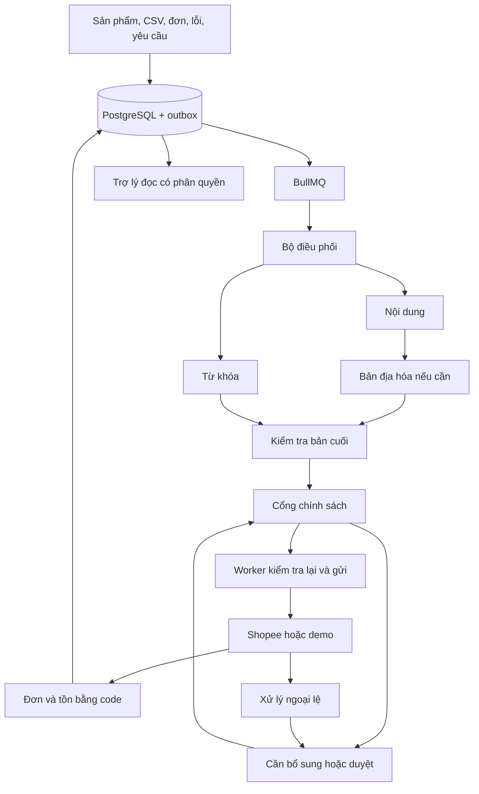

# Kế hoạch xây dựng các khối AI native

Ngày lập: 29/09/2026. Nguồn yêu cầu: [README của dự án](../../README.md), đặc biệt mục (6) đến (12), (14), (15). Đây là đặc tả triển khai, chưa phải báo cáo các tính năng đã hoạt động.

## Điểm xuất phát và cách dùng

Repo hiện có frontend Next.js, React và TypeScript; tại lần đối chiếu cuối, `package.json` có các lệnh `dev`, `build`, `start`, `lint`, `typecheck`, `test` và có test smoke dùng Node test runner. Chưa có dependency NestJS, PostgreSQL client, BullMQ, LangGraph hoặc AI SDK trong manifest. Các trang Trợ lý, Việc cần duyệt và Thị trường đã có vị trí giao diện, nhưng không dùng sự tồn tại của trang để kết luận backend đã hoàn thành.

Một người có nền tảng lập trình nên đọc tài liệu này, làm [khối 01](01-nen-tang-du-lieu-va-hop-dong.md), rồi theo các mốc bên dưới. Mỗi khối mô tả đầu vào/đầu ra, nơi viết code, thuật toán, tình huống lỗi, test phải viết trước và điều kiện bàn giao. Các đường dẫn code trong spec là đường dẫn đề xuất để tạo khi triển khai, không khẳng định file đã có. Không cần tạo mọi thư mục ngay từ đầu.

Tài liệu không cài thêm thư viện hay thay đổi ứng dụng. Khi bắt đầu viết code, xin chấp thuận dependency theo `AGENTS.md`, chốt phiên bản tương thích, đọc tài liệu đi kèm phiên bản và lưu lockfile. Không chép API mẫu của một phiên bản khác vào dự án.

## Phân định phạm vi đang mâu thuẫn trong README

| Nội dung | Cách áp dụng trong kế hoạch |
|---|---|
| Mục (1), (3), (9) yêu cầu thị trường/pháp lý; mục (10) nói chưa thu thập dữ liệu trong bản đầu | Viết đầy đủ spec 15–19. Chạy bộ dữ liệu tự nhập có nhãn; chỉ mở đánh giá thật sau khi có nguồn và người kiểm tra. Không coi thiếu dữ liệu là đạt pháp lý hoặc điểm 0. |
| Sơ đồ 4 có tạo ảnh và định giá; mục (15) loại trừ tạo ảnh và AI tự đổi giá | Spec 20 có lộ trình riêng. MVP chỉ kiểm tra ảnh và dùng giá người bán đã nhập. Sinh ảnh và gợi ý giá thuộc mở rộng; tự đổi giá vẫn bị cấm. |
| Sơ đồ module có Customer Service và xuất đơn | AI chăm sóc khách tự trả lời, logistics và xuất đơn không phải tác nhân MVP. Trợ lý chỉ hỗ trợ người bán; không tự nhắn khách. |
| Sơ đồ nhắc 6 trợ lý nhưng bảng (9) thêm Thị trường & Pháp lý | Bao phủ cả 6 tác nhân vận hành và các chức năng thị trường bằng các spec độc lập, không giới hạn cứng ở 6 tiến trình. |

Đây là giả định lập kế hoạch để giữ toàn bộ yêu cầu, không sửa README hay tự tuyên bố các mâu thuẫn đã được chủ sản phẩm phê duyệt.

## Các khối cần xây

| Khối | Đặc tả | Vai trò và phụ thuộc |
|---|---|---|
| 01 | [Nền tảng dữ liệu và hợp đồng](01-nen-tang-du-lieu-va-hop-dong.md) | Tenant, quyền, phiên bản, schema; làm đầu tiên |
| 02 | [Sự kiện, outbox và hàng đợi](02-su-kien-outbox-hang-doi.md) | Kích hoạt bền vững từ sản phẩm/CSV/đơn/lỗi; cần 01 |
| 03 | [Cổng gọi mô hình](03-cong-goi-mo-hinh.md) | Đầu ra có cấu trúc, chi phí, timeout, cache; cần 01 |
| 04 | [Bộ điều phối](04-bo-dieu-phoi.md) | LangGraph, nhánh, checkpoint, phục hồi; cần 02–03 |
| 05 | [Tác nhân nội dung](05-tac-nhan-noi-dung.md) | Soạn từ sự thật có nguồn; cần 03 |
| 06 | [Tác nhân bản địa hóa](06-tac-nhan-ban-dia-hoa.md) | Chuyển ngữ sau nội dung; cần 05 |
| 07 | [Tác nhân từ khóa](07-tac-nhan-tu-khoa.md) | Đề xuất độc lập với soạn nội dung; cần 03 |
| 08 | [Kiểm tra nội dung và quy tắc sàn](08-kiem-tra-noi-dung-va-quy-tac.md) | Kiểm tra bản cuối, nguồn, ảnh, danh mục; cần 05–07 |
| 09 | [Cổng chính sách và tự động hóa](09-chinh-sach-tu-dong-hoa.md) | Quyết định có được làm hay không; cần 01, 08 |
| 10 | [Đề xuất, phê duyệt và hoạt động](10-de-xuat-phe-duyet-hoat-dong.md) | M08/M15, bản xem trước, audit; cần 09 |
| 11 | [Thực thi qua sàn](11-thuc-thi-va-ket-noi-san.md) | Worker, Shopee/demo, đối soát kết quả; cần 02, 09–10 |
| 12 | [Đơn, tồn và giá](12-don-hang-ton-kho-gia.md) | Nghiệp vụ cố định để AI điều phối an toàn; cần 01–02, 11 |
| 13 | [Tác nhân ngoại lệ](13-tac-nhan-ngoai-le.md) | Retry đúng lỗi, đề xuất sửa; cần 03, 10–12 |
| 14 | [Trợ lý công việc](14-tro-ly-cong-viec.md) | Hỏi đáp có nguồn và đề nghị hành động; cần 03, 09–13 |
| 15 | [Quy định và pháp lý](15-quy-dinh-va-phap-ly.md) | Dữ liệu luật có phiên bản, kiểm tra phạm vi; cần 01, 03, 08 |
| 16 | [Chấm điểm thị trường](16-cham-diem-thi-truong.md) | Công thức minh bạch, dữ liệu có nguồn; cần 15 |
| 17 | [Market Knowledge Base](17-market-knowledge-base.md) | Nhập review, bằng chứng, truy xuất; cần 01–03 |
| 18 | [Kế hoạch vào thị trường](18-ke-hoach-vao-thi-truong.md) | Kế hoạch có nguồn và giả định; cần 15–17 |
| 19 | [Mô phỏng khách hàng và A/B](19-mo-phong-khach-hang-ab.md) | Thí nghiệm giả lập, không coi là chuyển đổi thật; cần 17–18 |
| 20 | [Ảnh và đề xuất giá mở rộng](20-anh-va-de-xuat-gia.md) | Tách rõ MVP/mở rộng, hợp nhất đề xuất; cần 08–11 |
| 21 | [Vận hành, bảo mật và phát hành](21-van-hanh-bao-mat-phat-hanh.md) | Quan sát, hạn mức, khôi phục, rollout; làm xuyên suốt |
| 22 | [Kiểm thử và nghiệm thu](22-kiem-thu-va-nghiem-thu.md) | Fixture, TDD, kịch bản xuyên suốt, đối chiếu README |

Một khối là trách nhiệm có thể kiểm thử độc lập, không nhất thiết là một agent LLM, service hay deployment. 01, 02, 09, 10, 11, 12 chủ yếu là code thông thường. Không dùng LLM để tính tồn, phân quyền hoặc cho phép đăng.

## Luồng toàn hệ thống

## Lộ trình có điểm nghiệm thu

| Mốc | Phạm vi xây | Bằng chứng trước khi đi tiếp |
|---|---|---|
| A. Nền móng | 01, 02, phần fixture của 22 | Hai tenant tách biệt; lưu sản phẩm tạo một job; tắt Redis rồi bật lại không mất job |
| B. Một lát cắt chạy hết | 03–05, 08–11 ở demo; phần tối thiểu của 04 | Lưu sản phẩm → nháp → duyệt → sàn demo xác nhận; không có khóa AI vẫn tự viết được |
| C. AI vận hành đầy đủ | 06–07, 12–14, hoàn thiện 04/09/10 | Đơn trùng/đồng thời an toàn; tự đăng có giới hạn; chat không vượt quyền; restart không trùng tác dụng |
| D. Shopee thật | Adapter thật của 11 và kiểm thử thật của 22 | Có quyền chính thức, một sản phẩm được phép, ID sàn và đọc lại khớp. Thiếu quyền ghi chưa xác minh |
| E. Thị trường | 15, 17, 16, 18, 19 theo thứ tự này | Nguồn có ngày, thiếu dữ liệu được thể hiện, điểm tính lại được, mô phỏng có nhãn |
| F. Mở rộng ảnh/giá | 20 | Chỉ bắt đầu khi phạm vi được bật rõ; mọi thay đổi vẫn qua bản xem trước và cổng thực thi |

21 và 22 chạy xuyên suốt, không đợi mốc cuối mới thêm bảo mật hoặc test. Không ước lượng số ngày trước khi đo tốc độ hoàn thành mốc A/B.

## Quy trình làm một khối

1. Đọc spec và các phụ thuộc; kiểm tra lại mã đang có trước khi tạo file.
2. Viết test cho điều kiện nhận việc, kết quả, quyền và lỗi. Chạy để thấy thất bại đúng nguyên nhân chưa có hành vi.
3. Viết schema runtime trước, rồi logic thuần, lưu dữ liệu, cuối cùng API/worker/UI.
4. Chạy unit test; chạy integration trên PostgreSQL/Redis dùng cho test với các khối có giao dịch hoặc queue.
5. Thử giao diện và đối chiếu bản ghi DB, không chỉ xem toast thành công.
6. Ghi bằng chứng: test nào, đầu vào, trạng thái trước/sau, số lần gọi sàn, phần dùng giả lập/phần thật.

Mọi khối phải qua kiểm thử tenant A/B, đầu vào sai, trạng thái cũ và gọi lặp nếu có tác dụng ghi. Không coi việc LLM trả đúng JSON là đã đúng sự thật.

## Từ điển ngắn

- Tenant: doanh nghiệp đang thao tác; `organizationId` được server xác minh.
- Snapshot: bản dữ liệu bất biến tại một phiên bản, để biết AI đã đọc gì.
- Proposal: đề xuất gồm thay đổi cụ thể và nguồn; chưa có quyền thực thi.
- Policy gate: hàm code kiểm tra quyền, điều kiện và phiên bản.
- Outbox: bản ghi sự kiện được lưu cùng giao dịch nghiệp vụ rồi chuyển vào hàng đợi.
- Idempotency: gửi lại cùng yêu cầu vẫn chỉ có một tác dụng nghiệp vụ.
- Checkpoint: điểm lưu bước chạy để tiếp tục sau gián đoạn.
- Reconciliation: đọc/đối chiếu bên sàn khi chưa biết request trước đã thành công hay chưa.

## Nguồn kỹ thuật

Các quyết định schema, ngưỡng và thuật toán nghiệp vụ trong bộ spec là đề xuất của dự án. Kiểm tra API thư viện theo phiên bản được chọn trước khi code.

- [LangGraph: thinking in LangGraph](https://docs.langchain.com/oss/javascript/langgraph/thinking-in-langgraph): tham khảo cách chia node, state và chờ đầu vào người dùng.
- [AI SDK: structured data](https://ai-sdk.dev/docs/ai-sdk-core/generating-structured-data): tham khảo đầu ra có schema; không suy ra schema bảo đảm tính đúng đắn nội dung.
- [BullMQ: idempotent jobs](https://docs.bullmq.io/patterns/idempotent-jobs): tham khảo yêu cầu job chịu được chạy lại.
- [Shopee developer guide](https://open.shopee.com/developer-guide/4) và [hướng dẫn được README dẫn](https://open.shopee.com/developer-guide/20): phải xác minh qua tài khoản được cấp quyền; spec chưa xác nhận endpoint hay năng lực chống trùng của Shopee.
- Next.js của repo: đọc `node_modules/next/dist/docs/` trước khi sửa frontend; không chuyển nghiệp vụ NestJS sang Route Handler chỉ để làm nhanh.
